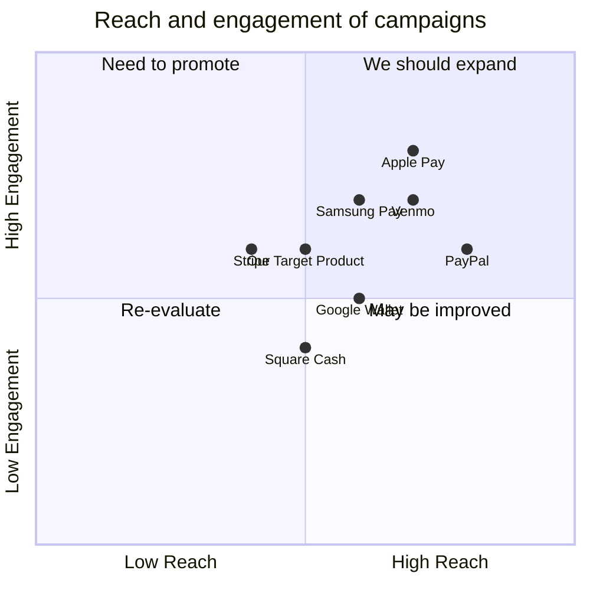

## Original Requirements
The boss wants to create a secure e-wallet app system that enables digital payments and expands financial access. The app must allow users to securely register and login to the e-wallet using email/password or social login like Google or Facebook. The app should use JSON Web Tokens for authentication. Users should be able to add bank accounts/cards, view balances, and transfer money between accounts within the e-wallet. The app should integrate with payment gateways like Stripe to enable loading money into the e-wallet from bank accounts or cards. The app should enable P2P payments to other users via email/mobile number within the e-wallet. The app should use industry standard practices like hashing passwords, encryption, HTTPS, etc. The app should implement 2-factor authentication for sensitive actions like withdrawals. The app should use end-to-end encryption for all payment transactions. No sensitive user data should be stored in plain text. The app should have comprehensive unit, integration and e2e tests. The tech stack to be used includes FastAPI, SQLAlchemy, Pydantic, Asyncio, Websockets, Stripe Python, PyTest, Tox, Docker, Kubernetes, Flower, Sentry SDK, Redis, Celery, MkDocs, and Python's built-in cryptographic libraries.

## Product Goals
```python
[
    "Create a secure e-wallet app that enables digital payments and expands financial access.",
    "Ensure user data security and privacy with industry standard practices.",
    "Provide a seamless user experience for managing and transferring money."
]
```

## User Stories
```python
[
    "As a user, I want to securely register and login to the e-wallet using my email/password or social login.",
    "As a user, I want to add my bank accounts/cards, view my balances, and transfer money between accounts within the e-wallet.",
    "As a user, I want to load money into the e-wallet from my bank accounts or cards.",
    "As a user, I want to make P2P payments to other users via email/mobile number within the e-wallet.",
    "As a user, I want my sensitive actions like withdrawals to be secured with 2-factor authentication."
]
```

## Competitive Analysis
```python
[
    "PayPal: A well-established digital wallet with a wide user base. However, it has high transaction fees and customer service issues.",
    "Venmo: Popular for P2P payments, especially among younger users. It lacks some features for business use.",
    "Google Wallet: Integrated with other Google services, but not as widely used for P2P payments.",
    "Square Cash: Known for business use, but less popular for personal use.",
    "Stripe: Known for its API and integration with businesses, but not typically used as a personal digital wallet.",
    "Apple Pay: Popular among Apple users, but limited to Apple devices.",
    "Samsung Pay: Similar to Apple Pay, but for Samsung devices."
]
```

## Competitive Quadrant Chart


## Requirement Analysis
The product should be a secure e-wallet app that allows users to register and login, add bank accounts/cards, view balances, transfer money, load money, and make P2P payments. It should use industry standard security practices and have comprehensive tests. The tech stack should include FastAPI, SQLAlchemy, Pydantic, Asyncio, Websockets, Stripe Python, PyTest, Tox, Docker, Kubernetes, Flower, Sentry SDK, Redis, Celery, MkDocs, and Python's built-in cryptographic libraries.

## Requirement Pool
```python
[
    ("Secure registration and login system with email/password or social login", "P0"),
    ("Ability to add bank accounts/cards, view balances, and transfer money", "P0"),
    ("Integration with payment gateways like Stripe for loading money", "P0"),
    ("P2P payments to other users via email/mobile number", "P0"),
    ("2-factor authentication for sensitive actions like withdrawals", "P0")
]
```

## UI Design draft
The app should have a clean and intuitive interface. The home screen should display the user's balance and recent transactions. There should be clear options for adding bank accounts/cards, transferring money, and making P2P payments. Sensitive actions like withdrawals should prompt for 2-factor authentication. The app should use a neutral color scheme with high contrast for readability.

## Anything UNCLEAR
There are no unclear points.