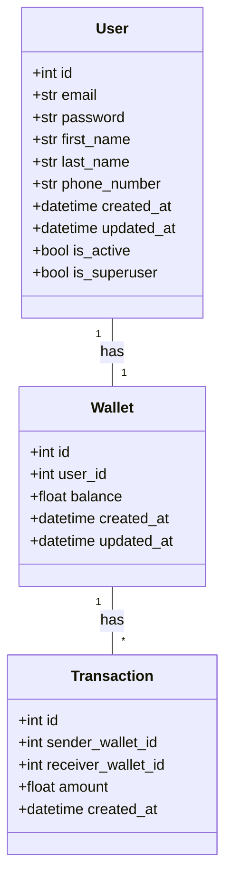
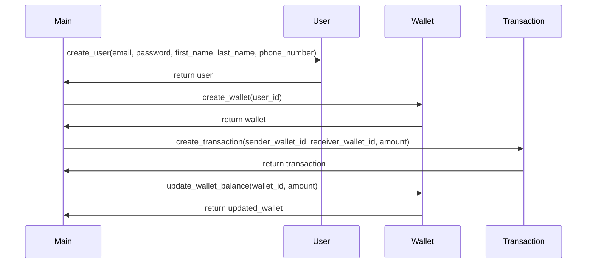

## Implementation approach
We will use FastAPI for building the APIs as it is a modern, fast (high-performance), web framework for building APIs with Python 3.6+ based on standard Python type hints. SQLAlchemy will be used for the ORM to interact with the database. Pydantic will be used for data validation and settings management using Python type annotations. Asyncio will be used for handling asynchronous operations. Websockets will be used for real-time communication. Stripe Python will be used for integrating with the Stripe payment gateway. PyTest and Tox will be used for running tests. Docker and Kubernetes will be used for containerization and orchestration. Flower will be used for real-time monitoring of Celery tasks. Sentry SDK will be used for error tracking. Redis and Celery will be used for task queue management. MkDocs will be used for documentation. Python's built-in cryptographic libraries will be used for encryption and hashing.

## Python package name
```python
"secure_ewallet"
```

## File list
```python
[
    "main.py",
    "models.py",
    "schemas.py",
    "routers.py",
    "tests.py",
    "config.py",
    "auth.py",
    "utils.py",
    "database.py",
    "exceptions.py",
    "middlewares.py",
    "tasks.py"
]
```

## Data structures and interface definitions


## Program call flow


## Anything UNCLEAR
The requirement is clear to me.